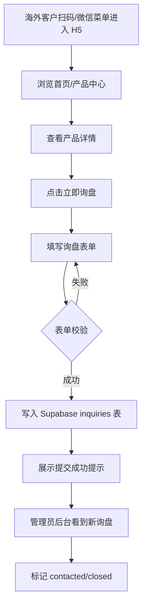
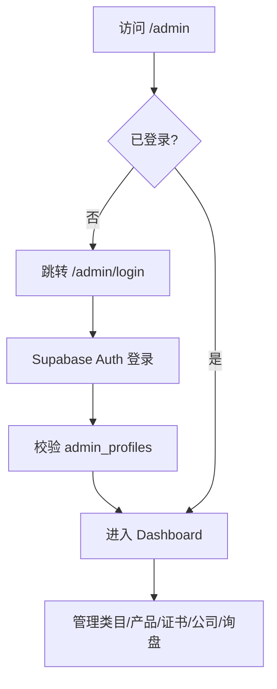
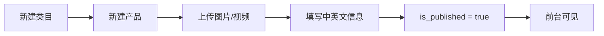

# KZQ 品牌 H5 产品展示站与后台管理系统 - 产品需求文档（PRD）

## 1. 产品概述

KZQ 是一个面向国内和海外客户展示产品、公司信息、资质和询盘联系方式的品牌。本项目为其构建一个"微信小程序风格"的 H5 产品展示中心 + 后台管理系统，可嵌入微信公众号菜单、可通过二维码在普通浏览器中访问，用于海外 B2B 询盘获客。

- **目标用户**：国内工程采购方、海外经销商与采购商、KZQ 内部管理员
- **核心价值**：以可信、专业、工业 B2B 的形态对外展示产品与资质，承接海外询盘，避免暴露内部敏感数据（成本、底价、客户名单等）
- **业务定位**：对外展示型系统，非 ERP / 非报价系统 / 非 CRM

## 2. 核心功能

### 2.1 用户角色

| 角色 | 注册/登录方式 | 核心权限 |
|------|---------------|----------|
| 匿名访客（前台） | 无需登录 | 浏览已发布产品/证书/公司信息，提交询盘 |
| 管理员（后台） | Supabase Auth（邮箱密码） | 管理类目/产品/证书/公司信息/询盘 |

### 2.2 功能模块

1. **前台 H5 展示端**：首页、产品中心、产品详情、资质证书、公司介绍、联系询盘
2. **后台管理系统**：登录、Dashboard、类目管理、产品管理、证书管理、公司信息、询盘管理
3. **数据与权限**：Supabase schema、RLS 策略、种子数据、Storage 权限
4. **SEO/GEO 基础**：metadata、JSON-LD、sitemap、robots、英文 slug

### 2.3 页面清单

| 端 | 页面名称 | 路由 | 核心模块 |
|----|----------|------|----------|
| 前台 | 首页 | `/` | Logo 区、slogan、核心优势、一级类目入口、主推产品、卖点（B级防火/E0环保）、证书入口、询盘入口、底部导航 |
| 前台 | 产品中心 | `/products` | 一级类目筛选、二级类目筛选、搜索、产品卡片列表（图/名/描述/尺寸/防火/环保/价格/查看详情） |
| 前台 | 产品详情 | `/products/[slug]` | 图片轮播、视频、名称、描述、类目、尺寸、材质、防火等级、环保等级、包装、物流、价格、MOQ、应用场景、相关证书、询盘按钮、分享 meta |
| 前台 | 资质证书 | `/certificates` | 证书列表（名称/图片/描述/适用范围），仅展示版/水印版图片 |
| 前台 | 公司介绍 | `/about` | 品牌介绍、能力介绍（产品/品控/生产交付/国内海外服务） |
| 前台 | 联系询盘 | `/contact` | 电话/邮箱/WhatsApp/微信二维码/地址 + 询盘表单（name/company/country/email/whatsapp/interested_product/quantity/message） |
| 后台 | 登录 | `/admin/login` | Supabase Auth 登录 |
| 后台 | Dashboard | `/admin` | 产品数、已发布产品数、证书数、询盘数、最近询盘列表 |
| 后台 | 类目管理 | `/admin/categories` | 一级/二级类目 CRUD、排序、启用/停用 |
| 后台 | 产品管理 | `/admin/products` | 列表/新增/编辑/删除/发布下架、图片上传、视频 URL、中英文字段、尺寸/材质/包装/物流/价格/MOQ/应用场景、默认 fire_rating=B级、eco_grade=E0、slug 可改、is_published |
| 后台 | 证书管理 | `/admin/certificates` | CRUD、图片上传、中英文名称描述、is_published |
| 后台 | 公司信息 | `/admin/company` | 公司介绍中英文、优势、联系方式（WhatsApp/邮箱/电话/地址/微信二维码） |
| 后台 | 询盘管理 | `/admin/inquiries` | 列表、详情、状态切换（new/contacted/closed） |

### 2.4 页面细节

| 页面 | 模块 | 功能描述 |
|------|------|----------|
| 首页 | 品牌区 | KZQ Logo + slogan，深色科技感 hero |
| 首页 | 核心优势 | 3-4 张能力卡（B级防火、E0环保、工程交付、海外询盘） |
| 首页 | 类目入口 | 一级类目网格入口 |
| 首页 | 主推产品 | is_featured 产品横向滑动卡 |
| 首页 | 卖点区 | B级防火、E0环保等级徽章展示 |
| 首页 | 底部 Tab | 首页/产品/证书/我的（联系）四 Tab |
| 产品中心 | 筛选 | 一级类目横向 chip、二级类目下拉、搜索框 |
| 产品中心 | 卡片 | 图、名、简短描述、尺寸、防火/环保徽章、价格、查看详情 |
| 产品详情 | 轮播 | 多图滑动，支持 video_url 或外链视频 |
| 产品详情 | 信息层 | 类目面包屑、规格表、材质、包装、物流、MOQ、应用场景 |
| 产品详情 | 相关证书 | 关联展示适用证书 |
| 产品详情 | 询盘 CTA | 固定底部"立即询盘"按钮跳 /contact |
| 资质证书 | 列表 | 卡片网格，点击放大查看展示版图片 |
| 公司介绍 | 能力区 | 产品能力 / 品控能力 / 生产交付 / 国内海外服务 |
| 联系询盘 | 表单 | 8 字段表单 + 基础校验 + 提交写入 inquiries |
| 后台 Dashboard | 统计卡 | 4 个数字卡 + 最近询盘表格 |
| 后台类目 | 树形 | 一级类目列表，展开二级，行内编辑 |
| 后台产品 | 表单 | 中英文双栏、图片多图上传、视频 URL、所有规格字段 |
| 后台证书 | 表单 | 图片上传 + 中英文 + is_published |
| 后台公司 | 表单 | 中英文富文本 + 联系方式 + 二维码上传 |
| 后台询盘 | 列表 | 状态筛选、状态切换、详情弹窗 |

## 3. 核心流程

### 3.1 海外客户询盘流程

### 3.2 管理员后台流程

### 3.3 产品发布流程

## 4. 用户界面设计

### 4.1 设计风格

- **整体气质**：工业 B2B、科技感、专业可信、干净不花哨，区别于零售电商
- **主色**：深石墨黑 `#0B0F14` 作为权威底色，搭配钢蓝 `#1E5BFF` 作为科技强调色，琥珀金 `#D4A24C` 作为品质点缀
- **辅助色**：中性灰阶（白/浅灰/深灰）构建信息层级
- **按钮风格**：圆角 8-12px，主按钮实色填充，次按钮描边，CTA 按钮带轻微阴影
- **字体**：标题用 "HarmonyOS Sans SC" / "Manrope"，正文用系统中文 + "Inter" fallback
- **布局**：移动端优先单列，桌面端居中容器 max-width 480px 模拟小程序，后台桌面端左侧导航
- **图标**：线性图标（lucide-react），克制使用
- **动效**：页面切换淡入、卡片 hover 轻微上浮、Tab 切换滑动指示器

### 4.2 页面设计概览

| 页面 | 模块 | UI 元素 |
|------|------|---------|
| 首页 | Hero | 深色背景 + Logo + slogan + 渐变光晕 |
| 首页 | 优势卡 | 4 列网格，图标 + 标题 + 一句话 |
| 首页 | 类目入口 | 2 列卡片，带类目图 |
| 首页 | 主推产品 | 横向滑动卡，带价格徽章 |
| 首页 | 底部 Tab | 固定底部 4 Tab，活跃态高亮 |
| 产品中心 | 筛选条 | 顶部 sticky，chip 横向滚动 |
| 产品中心 | 卡片 | 图在上，信息在下，徽章 chips |
| 产品详情 | 轮播 | 16:9 图片滑动 + 视频区块 |
| 产品详情 | 规格表 | 双列 key-value 表 |
| 证书页 | 网格 | 2 列卡片，点击全屏查看 |
| 公司页 | 区块 | 交替图文，能力图标列表 |
| 联系页 | 表单 | 卡片式分组输入，必填红星 |
| 后台 | 布局 | 左侧导航 + 顶部用户 + 主内容区 |
| 后台 | 统计卡 | 4 卡网格，数字大字号 |
| 后台 | 列表 | 表格行 + 操作按钮 |
| 后台 | 表单 | 双语 Tab 切换中/英 |

### 4.3 响应式

- **前台**：移动端优先（375px 基线），桌面端居中容器不崩坏，底部 Tab 仅移动端固定
- **后台**：桌面端为主（≥1024px），平板自适应折叠侧栏，移动端可访问但非首要场景
- **触摸优化**：按钮最小点击区 44px，卡片间距充足

### 4.4 数据安全边界（重要）

**允许放入系统**：公司介绍、品牌介绍、产品类目、产品图片/视频、产品尺寸、公开展示价格、物流说明、资质证书（展示版）、联系方式、海外询盘表单。

**禁止放入系统**：成本价、最低成交价、客户名单、供应商信息、合同、内部报价单、未公开产品、生产配方、完整高清证书源文件、内部物流成本、销售提成规则。

## 5. 非功能性要求

- **性能**：前台首屏 LCP < 2.5s，图片懒加载，Next.js Image 优化
- **SEO**：每页独立 metadata，产品详情 JSON-LD Product，公司页 Organization JSON-LD，sitemap.xml，robots.txt
- **国际化**：中英文字段预留，前台默认中文，后续可扩展语言切换
- **安全**：service_role 仅服务端，前台仅 anon key，RLS 强制开启，询盘匿名可写不可读
- **可部署**：EdgeOne（正式生产平台，Node 20）+ Supabase；Vercel 已废弃
- **可运行**：本地 `npm install && npm run dev` 可直接跑通，连接 Supabase 后全功能可用
