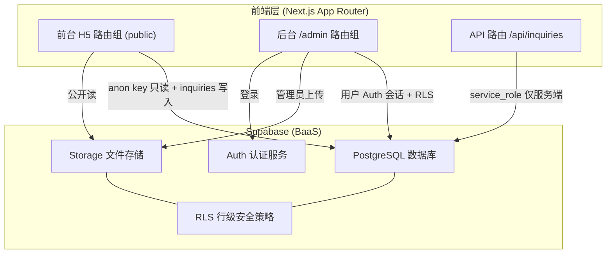
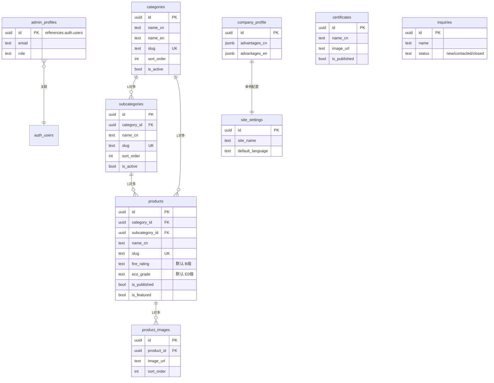

# KZQ 品牌 H5 产品展示站与后台管理系统 - 技术架构文档

## 1. 架构设计



## 2. 技术描述

- **前端框架**：Next.js 14+ App Router + React 18 + TypeScript
- **样式**：Tailwind CSS 3 + lucide-react 图标
- **BaaS**：Supabase（PostgreSQL + Auth + Storage + RLS）
- **客户端 SDK**：`@supabase/supabase-js`（浏览器用 anon key，服务端用 service_role key）
- **初始化工具**：`create-next-app`（手动追加依赖）
- **部署目标**：Vercel（首选）/ Cloudflare Pages（兼容）
- **不使用**：复杂状态管理库、冷门 UI 框架、需要额外运行时的技术

## 3. 路由定义

| 路由 | 用途 | 渲染方式 | 权限 |
|------|------|----------|------|
| `/` | 前台首页 | SSG/ISR | 公开 |
| `/products` | 产品中心 | SSR/ISR | 公开 |
| `/products/[slug]` | 产品详情 | SSR + generateStaticParams | 公开 |
| `/certificates` | 证书页 | SSR/ISR | 公开 |
| `/about` | 公司介绍 | SSR/ISR | 公开 |
| `/contact` | 联系询盘 | SSR | 公开 |
| `/admin/login` | 管理员登录 | 静态 | 公开 |
| `/admin` | Dashboard | SSR（鉴权） | 管理员 |
| `/admin/categories` | 类目管理 | SSR（鉴权） | 管理员 |
| `/admin/products` | 产品列表 | SSR（鉴权） | 管理员 |
| `/admin/products/new` | 新增产品 | 静态（鉴权） | 管理员 |
| `/admin/products/[id]/edit` | 编辑产品 | SSR（鉴权） | 管理员 |
| `/admin/certificates` | 证书管理 | SSR（鉴权） | 管理员 |
| `/admin/company` | 公司信息 | SSR（鉴权） | 管理员 |
| `/admin/inquiries` | 询盘管理 | SSR（鉴权） | 管理员 |
| `/api/inquiries` | 询盘提交接口 | Route Handler | 公开（POST） |
| `/sitemap.xml` | 站点地图 | Route Handler | 公开 |
| `/robots.txt` | 爬虫规则 | 静态 | 公开 |

## 4. API 定义

### 4.1 询盘提交 API

```typescript
// POST /api/inquiries
interface InquiryPayload {
  name: string;
  company?: string;
  country?: string;
  email?: string;
  whatsapp?: string;
  interested_product?: string;
  quantity?: string;
  message?: string;
}

interface InquiryResponse {
  success: boolean;
  id?: string;
  error?: string;
}
```

### 4.2 服务端 Supabase 客户端封装

```typescript
// lib/supabase/server.ts - 使用 anon key + 用户会话（前台/后台通用）
// lib/supabase/admin.ts - 使用 service_role key（仅 /api 路由或服务端强写入）
// lib/supabase/client.ts - 浏览器客户端（anon key）
```

## 5. Supabase 数据模型

### 5.1 ER 关系图



### 5.2 表结构 DDL 摘要

完整 DDL 见 `supabase/schema.sql`，包含 9 张表：
`admin_profiles` / `categories` / `subcategories` / `products` / `product_images` / `certificates` / `inquiries` / `company_profile` / `site_settings`

### 5.3 RLS 策略摘要

完整策略见 `supabase/policies.sql`：

| 表 | 匿名读 | 匿名写 | 管理员读写 |
|----|--------|--------|------------|
| categories | is_active=true | ❌ | ✅ 全部 |
| subcategories | is_active=true | ❌ | ✅ 全部 |
| products | is_published=true | ❌ | ✅ 全部 |
| product_images | 关联产品已发布 | ❌ | ✅ 全部 |
| certificates | is_published=true | ❌ | ✅ 全部 |
| company_profile | ✅ | ❌ | ✅ 全部 |
| site_settings | ✅ | ❌ | ✅ 全部 |
| inquiries | ❌ | ✅ INSERT | ✅ 全部 |
| admin_profiles | ❌ | ❌ | ❌ 仅服务端 |

### 5.4 Storage Buckets

| Bucket | 用途 | 公开读 | 管理员写 |
|--------|------|--------|----------|
| public-assets | 产品图、展示版证书、Logo、微信二维码 | ✅ | ✅ |
| private-assets | 预留（高清证书源文件等，前台不可访问） | ❌ | ✅ |

## 6. 目录结构

```
kzq-h5/
├── app/
│   ├── (public)/                 # 前台路由组
│   │   ├── page.tsx              # 首页
│   │   ├── products/
│   │   │   ├── page.tsx          # 产品中心
│   │   │   └── [slug]/page.tsx   # 产品详情
│   │   ├── certificates/page.tsx
│   │   ├── about/page.tsx
│   │   ├── contact/page.tsx
│   │   └── layout.tsx            # 前台布局（含底部 Tab）
│   ├── admin/
│   │   ├── login/page.tsx
│   │   ├── page.tsx              # Dashboard
│   │   ├── categories/page.tsx
│   │   ├── products/
│   │   │   ├── page.tsx
│   │   │   ├── new/page.tsx
│   │   │   └── [id]/edit/page.tsx
│   │   ├── certificates/page.tsx
│   │   ├── company/page.tsx
│   │   ├── inquiries/page.tsx
│   │   └── layout.tsx            # 后台布局（含侧栏 + 鉴权）
│   ├── api/
│   │   └── inquiries/route.ts
│   ├── sitemap.ts
│   ├── robots.ts
│   ├── layout.tsx                # 根布局
│   └── globals.css
├── components/
│   ├── public/                   # 前台组件
│   ├── admin/                    # 后台组件
│   └── ui/                       # 通用 UI
├── lib/
│   ├── supabase/
│   │   ├── server.ts
│   │   ├── admin.ts
│   │   └── client.ts
│   └── utils.ts
├── types/
│   └── database.ts               # 数据库类型
├── supabase/
│   ├── schema.sql
│   ├── policies.sql
│   └── seed.sql
├── public/
├── .env.example
├── .env.local                    # 本地配置（不入库）
├── next.config.mjs
├── tailwind.config.ts
├── tsconfig.json
├── package.json
├── README.md
├── SECURITY.md
└── DEPLOYMENT.md
```

## 7. 关键实现要点

### 7.1 鉴权流程

- 后台 `admin/layout.tsx` 服务端读取 Supabase 会话，无会话 → redirect `/admin/login`
- 登录页使用 Supabase Auth `signInWithPassword`，成功后写 `admin_profiles`（首次自动插入或由 SQL 预置）
- 后台所有写操作走用户会话 + RLS（无需 service_role）
- `service_role` 仅用于 `/api/inquiries`（匿名写询盘）或服务端强写入场景

### 7.2 图片上传封装

- `lib/supabase/storage.ts` 封装 `uploadPublicImage(file, path)` 返回公开 URL
- 后台表单调用，前台仅展示 URL

### 7.3 SEO 实现

- 每个页面 `export const metadata` 或 `generateMetadata`
- 产品详情页注入 JSON-LD Product
- 公司页注入 JSON-LD Organization
- `app/sitemap.ts` 动态生成包含所有已发布产品
- `app/robots.ts` 输出 robots.txt

### 7.4 移动端适配

- Tailwind 移动优先断点
- 前台 `max-w-[480px] mx-auto` 模拟小程序容器
- 底部 Tab `fixed bottom-0` 仅移动端显示
- 触摸目标 ≥ 44px

### 7.5 错误处理与空状态

- 所有列表页有空状态插画/文案
- 表单提交有 loading / success / error 三态
- 后台操作成功 toast 提示
- 登录态失效自动跳转 `/admin/login`
